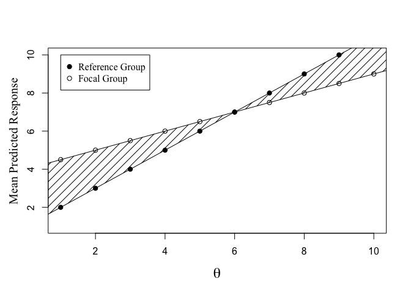
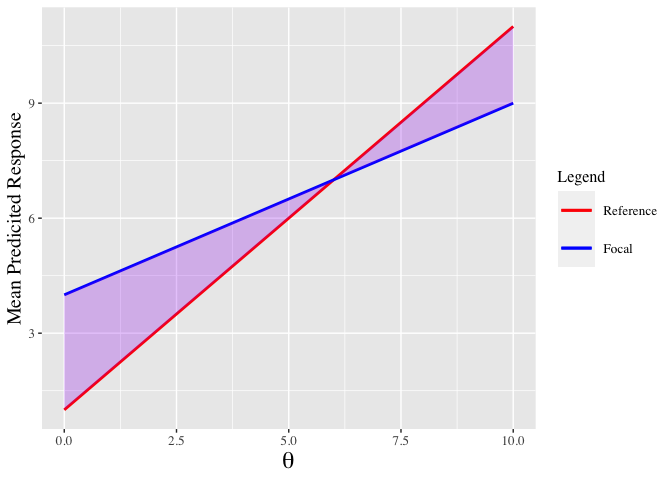

Portfolio-2
================
Conor Lacey
2023-02-11

``` r
suppressWarnings(library(tidyverse))
```

    ## ── Attaching packages ─────────────────────────────────────── tidyverse 1.3.2 ──
    ## ✔ ggplot2 3.4.0     ✔ purrr   0.3.4
    ## ✔ tibble  3.1.8     ✔ dplyr   1.0.8
    ## ✔ tidyr   1.1.4     ✔ stringr 1.4.0
    ## ✔ readr   2.1.3     ✔ forcats 0.5.1
    ## ── Conflicts ────────────────────────────────────────── tidyverse_conflicts() ──
    ## ✖ dplyr::filter() masks stats::filter()
    ## ✖ dplyr::lag()    masks stats::lag()

### Introduction

So for this portfolio I want to make some graphs and plots for my
thesis. I will refine some previous graphics I’ve done as well as add
some new ones.

### Linear representation of DIF

The first plot I will do will refine this plot that I used previously in
my thesis prospectus.

``` r
x<-seq(0,11)

y1=1+x
y2=4+(.5*x)

plot(x,y1,pch =19,
     ylim =c(1,10),xlim = c(1,10),
     xlab = expression(theta), ylab = "",
     cex.lab = 1.5)
lines(x,y2,type = "p")

op <- par(family = "Times New Roman")

title(ylab = "Mean Predicted Response",cex.lab=1.25 ,line = 2.4, )

polygon(c(x,rev(x)),c(y2,rev(y1)),
        density = 10, angle = 45)

legend(1,10, legend = c(
  "Reference Group", "Focal Group"),
  pch = c(19,1),
  cex=1)
```

<!-- -->

So the plot gets the message across that DIF is captured in the space
between the reference and focal groups for a single item in a
measurement invariance study. However, I think I can make this look
prettier as well as make the code for this less chunky.

``` r
#Coordinates for regression lines
x = seq(0,10)
y1 = 1+x
y2 = 4+(.5*x)
dat <- data.frame(x, y1, y2)

#Polygon Coordinates
px<-c(x,rev(x))
py<-c(y2,rev(y1))
pdat<-data.frame(px,py)


dat %>% ggplot(aes(x = x)) + 
  labs(x = expression(theta),
       y = "Mean Predicited Response") + 
  geom_line(aes(y= y1, color = "Reference"), linewidth = 1) +
  geom_line(aes(y = y2, color = "Focal"), linewidth =1) +
  scale_color_manual(name = "Legend",
                     breaks = c("Reference", "Focal"),
                     values = c("Reference" = "red", "Focal" = "blue")) +
  geom_polygon(data = pdat, aes(x =px, y =py), fill = "purple", alpha = .25) +
  theme(text = element_text(family = "Times"),
        axis.title.y = element_text(size = 15),
        axis.title.x = element_text(size = 18),
        axis.text = element_text(size = 10),
        legend.key.size = unit(1,"cm"),
        legend.title = element_text(size = 12),
        legend.text = element_text(size = 10))  
```

<!-- -->
